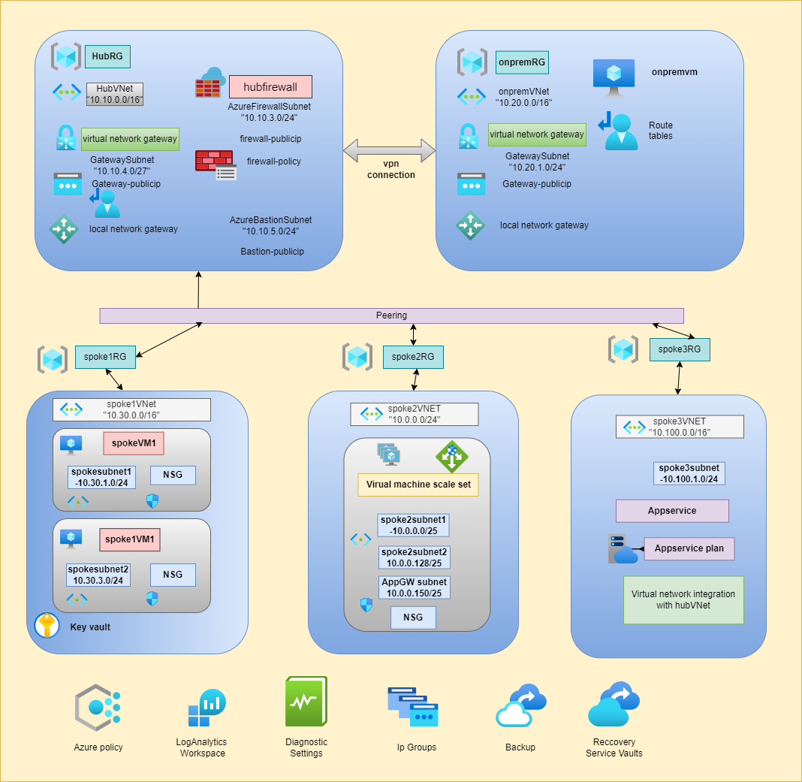

# Terraform-Hub and Spoke Architecture

# Project Documentation

## Resource Groups

### On-Premises Resource Group
- Detailed overview of on-premises resource group configurations.
- Guidelines for setup, management, and maintenance.
- Best practices for optimizing performance and security.

### Spoke 01 Resource Group
- Configuration and deployment details for Spoke 01.
- Integration with hub and other spokes.
- Security, monitoring, and optimization guidelines.

### Spoke 02 Resource Group
- User-Defined Route (UDR) setup and management.
- Subnet association and traffic routing through firewall.
- Optimization and troubleshooting tips.

### Spoke 03 Resource Group
- Configuration and deployment details for Spoke 03.
- Integration with Azure App Service and virtual network.
- Security and monitoring guidelines.

### Hub Resource Group
- Centralized services and networking overview.
- Integration and communication between spokes.
- Maintenance and monitoring best practices.

### Azure App Service Resource Group
- Deployment and configuration of Azure App Service.
- Integration with virtual network and other services.
- Performance tuning and security practices.

### Azure Policies Resource Group
- Policy definitions and scope at the resource group level.
- Enabling diagnostics logs and region limitations.
- Compliance and auditing guidelines.

### VM Backup Resource Group
- Configuration for regional replication of VM backups.
- Backup scheduling and retention policies.
- Recovery and disaster recovery planning.

## Footer

**Document Version:** 1.0  
**Last Updated:** [3/7/2023]  
**Prepared by:** [Aflal ahmad]  
**Organization:** [Cloud Slize]  

# Contributing

We welcome contributions to improve this Terraform Project.
