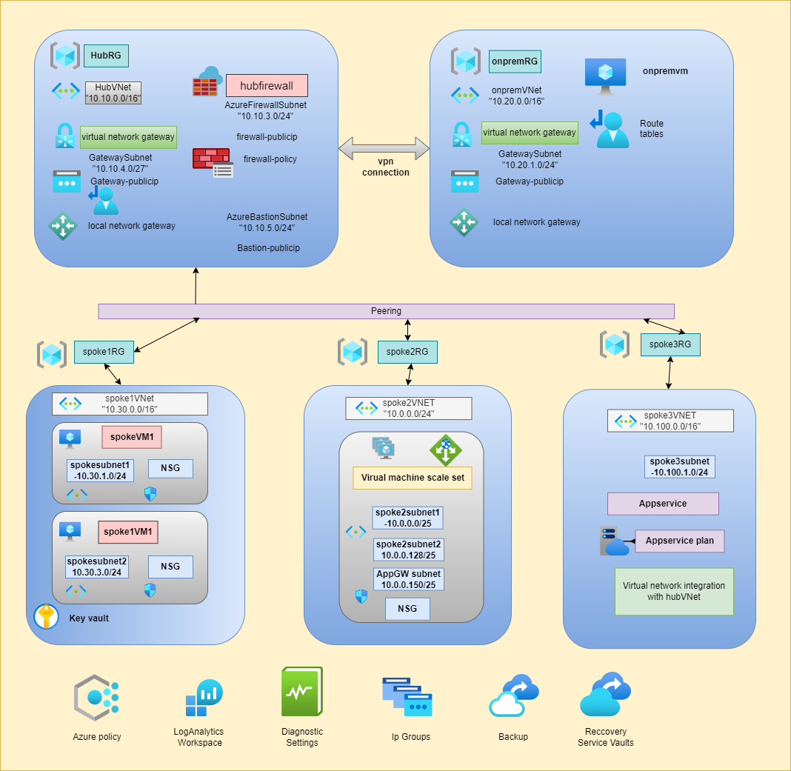

# 🌐 Hub-Spoke Network Topology in Azure
     

## 📘 Description:
This project implements a robust Azure Hub and Spoke architecture designed to manage a multi-tier application environment with high security, scalability, and efficiency. The hub functions as a central point for managing shared resources, such as DNS, firewall, and VPN connections, while each spoke represents a separate environment (e.g., development, testing, production) with isolated resources. This architecture not only ensures streamlined communication between on-premises resources and Azure but also enhances security by segregating workloads across different spokes.

## 🛠 Steps:
### 📁 Create Backend Configuration:

- Set up a backend file to store Terraform state files securely, enabling efficient team collaboration and tracking of infrastructure changes.
### 🏗 Create Hub and Spoke Networks:

### On-Premises Network:
- Establish a secure connection from the on-premises network to the Azure hub using a Site-to-Site (S2S) VPN Gateway.
### Hub Network:
- Create the central hub network, which will act as the main point of connectivity and resource management for all spokes.
### Spoke Networks:
- Deploy Spoke_01, Spoke_02, and Spoke_03 networks, each isolated but connected to the hub via VNet peering.
🔗 Configure Connectivity:

### VPN Gateway:
- Set up a VPN Gateway in the hub to facilitate the secure connection with on-premises resources.
### VNet Peering:
- Peer Spoke_01, Spoke_02, and Spoke_03 networks with the hub network to allow communication through the hub.
### Route Tables:
- Implement user-defined route tables to control the flow of traffic between spokes through the hub.
## 🔒 Enable Security and Monitoring:

### Azure Firewall:
- Deploy an Azure Firewall within a dedicated subnet in the hub to enforce network security policies across all connected networks.
### NSG Flow Logs and Monitoring:
- Enable Network Security Group (NSG) Flow Logs and VNet Flow Logs, directing all logs to an Azure Log Analytics workspace for centralized monitoring.
## 💾 Implement Backup and Recovery:

### VM Backups:
- Ensure all VMs across the hub and spoke networks have daily backups enabled, with regional replication for enhanced data redundancy.
### Recovery Plans:
- Develop and implement recovery strategies to ensure business continuity in case of data loss or failure.
## 📝 Apply Azure Policies:

### Policy Enforcement:
- Scope Azure Policies at the resource group level to enforce security and compliance requirements across all networks.
## 🗺 Architecture Diagram:

## 🔄 Workflow:
### 🌐 Hub Virtual Network:

- Hosts shared services like DNS, firewalls, and VPN gateways, serving as the central point for all connectivity.
### 🧩 Spoke Virtual Networks:

- Isolate workloads into separate environments. Each spoke is peered with the hub, ensuring secure and controlled communication.
### 🔗 Virtual Network Connectivity:

- VNet Peering connects the hub and spoke networks, allowing low-latency, high-bandwidth communication across the Azure backbone.
### 🔒 Azure Bastion:

- Provides secure, browser-based RDP/SSH connectivity to VMs in both the hub and spoke networks, without exposing them to the public internet.
### 🔐 Private Endpoints:

- Ensure that services like Azure Storage and SQL Database remain accessible only within the virtual network, enhancing security by eliminating public exposure.
### 🔑 SSL Certificates:
- SSL certificates are securely stored in Azure Key Vault and integrated into the Application Gateway within the spoke network to ensure secure communication.
### 📊 Azure Monitor:

- Collects and analyzes telemetry data from across the entire network, ensuring high availability and performance of applications and services.
🔧 Components:
### 🌐 Virtual Network (VNet):

- Core component providing isolated and secure networking environments for all resources.
### Gateway:
- Configure VNet peering or connected network groups to enable communication between spokes and remote networks through the hub gateway.
### 🔒 Azure Firewall:

- Managed, cloud-based network security service that enforces consistent security policies across the hub and spokes.
### 🔑 VPN Gateway:

- Facilitates secure, cross-premises connectivity between Azure and on-premises environments.
### 🔒 Azure Bastion:

- Provides secure access to VMs within the Azure network without needing public IP addresses.
### 🔒 Private Endpoint:

- Secures access to Azure services by routing traffic through private IP addresses within the virtual network.
### ⚙️ Application Gateway (optional):

- Provides load balancing and routing for web applications hosted within the spoke networks.
### 🧩 Azure Private DNS Zone:

- Manages domain names within the virtual network, allowing custom domain names for internal resources.
## 📊 Azure Networking Details:
### 🔢 Reserved IP Addresses:

- The first four and the last IP addresses within each subnet are reserved for Azure’s use.
### 🗂 Subnets:

### 🏢 Hub Network:

#### GatewaySubnet:
- Example IP range: 10.0.0.0/27
- Required for VPN Gateway.
#### AzureFirewallSubnet:
- Example IP range: 10.0.1.0/26
- Hosts Azure Firewall and requires a specialized subnet.
#### Dedicated Subnets:
- Allocate specific subnets for other critical resources as needed.
## 🏠 Spoke Networks:

### Spoke_01:
- Example IP range: 10.1.0.0/24
### Spoke_02:
- Example IP range: 10.2.0.0/24
### Spoke_03:
- Example IP range: 10.3.0.0/24

## 🔄 Spoke Connectivity:
### 🛠 Spoke Connections through Azure Firewall or NVA:
- Use Azure Firewall or another Network Virtual Appliance (NVA) in the hub to facilitate traffic between spokes.
### 🌐 Spoke Connections to Remote Networks through Hub:

#### ⚠️ Note on Connectivity:
- Currently, pinging VMs in the spoke network from the on-premises network is not functioning as expected. Troubleshooting is ongoing, and updates will be provided once the issue is resolved.
### 🔍 Considerations:
### 🔧 Service Integration and Testing:

#### Ping Connectivity Issue:
- There is an ongoing issue with pinging VMs in the spoke network from the on-premises environment. This is being actively investigated, and resolution steps will be updated accordingly.

### 🔄 Spoke Communication Methods:
- Choose between using Azure Firewall/NVA or VNet peering for inter-spoke communication based on your latency and bandwidth requirements.
## 🔍 Considerations:
### 🔧 Evaluate Services in the Hub:
- Ensure that the hub scales effectively for the number of spokes and consider service limits for components like firewalls.
### 🔄 High-Availability:
- Assess and implement strategies for high-availability and redundancy to support a growing number of spokes and services.

### Feedback
**Was this document helpful?**  
 

<h4>Written By,</h4>
<a href="https://www.linkedin.com/in/aflalahmadav/">Aflal ahmad</a>
<h6>Cloud Engineer Intern @ CloudSlize</h6>

